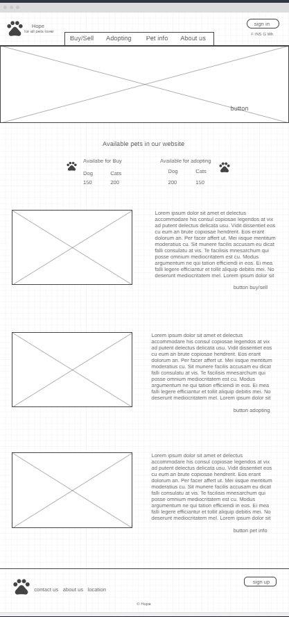
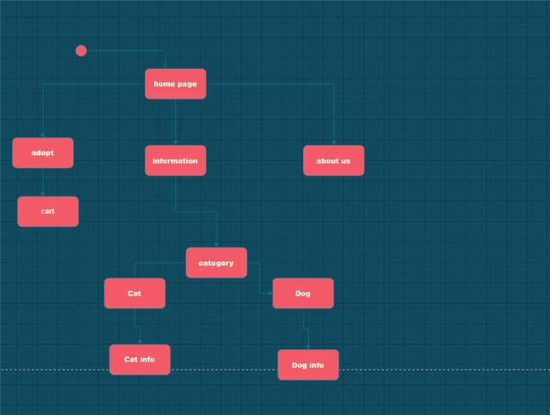

# task 1

# 1:
## business-related problem 
	There are a lot of animals without shelter and they need home and someone to take care of it and we need to help them all

 ##   Solution:
	We created a website for adopt pets that show available pets for adoption with information about them to make it easy to find the suitable pet for the user. 

    

## problems during project:
in the projects we useualy face some problems and we cant finish the project in the right way without fix the problems and make the job clear without problems to give the best work in the best time.

+ lack of comunicate
+ wrong time manegment 
+ stay in scope 
+ changes on plan
+ lack planing

## solutions

+ find a good way to comunicate and do meetings to see the process
make a scope plan
+ use tools like trello to manage time
+ be flexible for new changes
+ make a good plan and wire frames before start working

## System Requirements:

+ local storage
+ buttons
+ add to cart functions

## User requirements:

+ slide show pictures 
+ flipping card pictures
+ buttons
+ animations in the pages

# 2:
## Risks

+ Schedule Risk
we might face risks in time like the dead line is about to come and the project didnt finish yet or the tasks are taking more time than expicted and that cause delay in the project

+ financial risks 
in the projects the budget is the most imortant thing and without it the project cant finish without a good budget that cover all the requirements 

+ changes requirements
during the project sometimes the plan changes and we need for another plan for it quickly and be flexible to finish the project on time

# 3:

first of all we find the idea then we put the system requirements and user requirements like what i will show as next:

### User requirements:

+ slide show pictures 
+ flipping card pictures
+ buttons
+ animations in the pages

### System Requirements:

+ local storage
+ buttons
+ add to cart functions

- then we needed to make a wireframes for the project as next:

- and the data base was simple it was a local storage that store the image and the name of the chosen pet after click on the button.

---

- we create an activity diagram for the user as next 

after all the planing parts its time to start the actual work so we used agile methodology and we divide the whole project into tasks and each one in the team take his part in the project by finish his tasks then we merge all the work together

for the testing step we used black box technique 
Black box testing involves testing a system with no prior knowledge of its internal workings. A tester provides an input, and observes the output generated by the system under test.

### 

https://kissflow.com/project/project-management-challenges/
